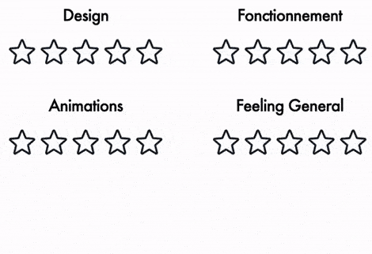

# Rating app

A replica of the rating app by Benjamin Code shown in this video : https://youtu.be/s8lIDkjqt_s.

## Specifications

- [x] 4 criterias (design, fonctionnement, animations, feeling general) with a rating from 1 to 5 stars
- [x] A total that only appears when all criterias are rated, with an animation
- [x] The total can have a decimal value, an must show the last star as partially filled if needed
- [x] The stars colors must change from dark orange to yellow depending on the rating
- [x] Hover animation on the star
- [x] Show a faded yellow colors on the stars when the mouse is over them, from the left to the hovered star

## Bonus features

- [x] Possibility to remove a rating by clicking on the star again
- [x] Stars previously selected wiggle when not selected anymore
